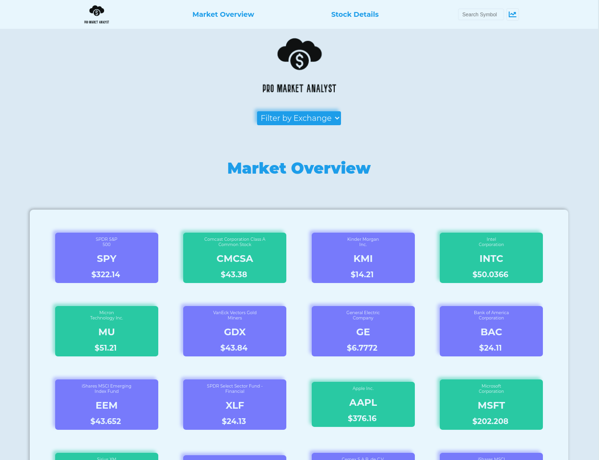
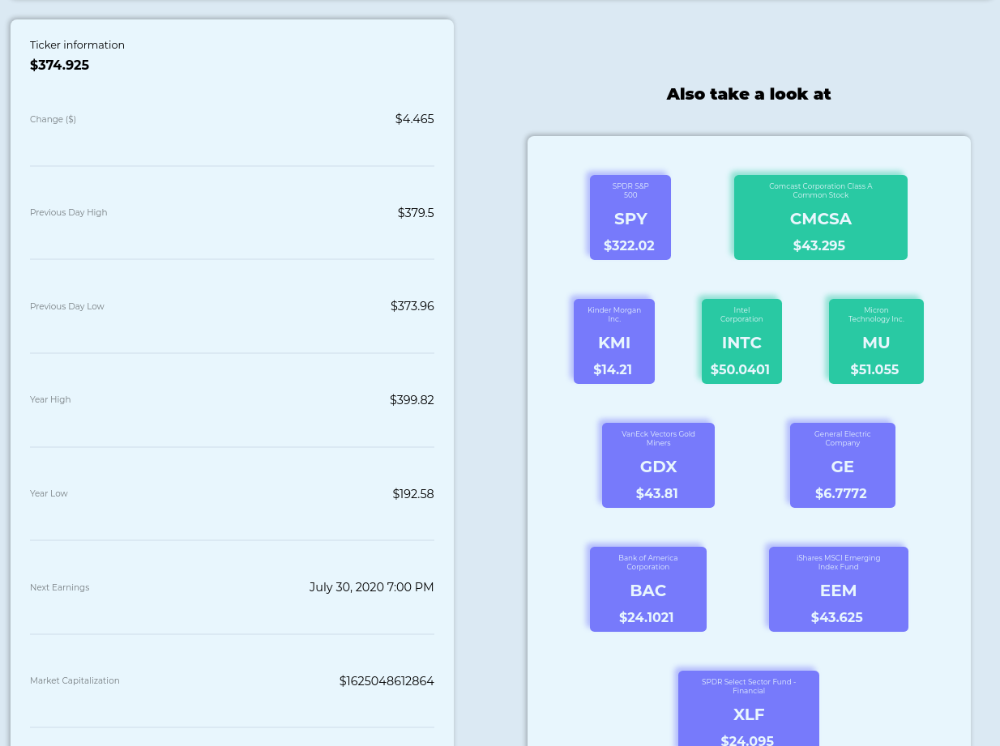

# React Redux Capstone Project: Stock Screener! (Catalogue of Dog Clothes)

[![Contributors][contributors-shield]][contributors-url]
[![Forks][forks-shield]][forks-url]
[![Stargazers][stars-shield]][stars-url]
[![Issues][issues-shield]][issues-url]

> For this project, I created a Stock Screener, using React and Redux. The project consists of a frontend application that fetches information from an API, stores it in the Redux store, and accesses it using React Hooks when necessary. I implemented the solution using React Routes for the SPA (Single Page Application), two pages, and several containers and components. Redux was used to store and manage the state of every React Component throughout the application. The application also features the possibility of providing detailed information and charting for any stock in the US, Toronto, Paris, Amsterdam, and Brussels markets plus some ETFs.






> This project was very challenging and comprehensive, which required me to learn how to work with asynchronous calls using Redux, React Hooks, and API calls implementation. I used all the knowledge acquired in the Javascript and React/Redux sections of the curriculum to be able to complete this project in the requested time.

## Live Version

[Stock Screener](https://stock-screener-capstone.herokuapp.com/)

## Built With

### Developing tools

- React
- JavaScript
- ESlint
- Stylelint
- Redux
- Chart.js
- Moment
- React Router
- Redux Thunk
- Financial Modeling Prep API

### Deployment

- Heroku

## Getting Started

To get started with the app, please follow these steps:

- Navigate to the folder where you would like to save the app.

- Open your terminal by right-clicking, and opening the command line of your choice.

- Clone the repo by typing:

```
$ git@github.com:lmaldonadoch/stock-screener-react-capstone.git
```

- Access the newly created folder by typing:

```
$ cd stock-screener-react-capstone
```

- Install the necessary dependencies:

```
npm install
```

## Available Scripts

In the project directory, you can run:

### `npm start`

Runs the app in the development mode.<br />
Open [http://localhost:3000](http://localhost:3000) to view it in the browser.

The page will reload if you make edits.<br />
You will also see any lint errors in the console.

### `npm test`

Launches the test runner in the interactive watch mode.<br />
See the section about [running tests](https://facebook.github.io/create-react-app/docs/running-tests) for more information.

### `npm build`

Builds the app for production to the `build` folder.<br />
It correctly bundles React in production mode and optimizes the build for the best performance.

The build is minified and the filenames include the hashes.<br />
Your app is ready to be deployed!

See the section about [deployment](https://facebook.github.io/create-react-app/docs/deployment) for more information.

### `npm eject`

**Note: this is a one-way operation. Once you `eject`, you can’t go back!**

If you aren’t satisfied with the build tool and configuration choices, you can `eject` at any time. This command will remove the single build dependency from your project.

Instead, it will copy all the configuration files and the transitive dependencies (webpack, Babel, ESLint, etc) right into your project so you have full control over them. All of the commands except `eject` will still work, but they will point to the copied scripts so you can tweak them. At this point you’re on your own.

You don’t have to ever use `eject`. The curated feature set is suitable for small and middle deployments, and you shouldn’t feel obligated to use this feature. However we understand that this tool wouldn’t be useful if you couldn’t customize it when you are ready for it.

### Prerequisites

- Node. If you do not have Node installed in your local machine, please refer to the [Official Documentation](https://nodejs.org/en/download/)
- React. If you do not have React installed in your local machine, please refer to [Official Documentation](https://reactjs.org/)
- Basic command line knowledge.

## Author

👤 **Luis Angel Maldonado**

- Github: [@lmaldonadoch](https://github.com/lmaldonadoch)
- Twitter: [@LuisAngelMCh](https://twitter.com/LuisAngelMCh)
- LinkedIn: [lmaldonadoch](https://www.linkedin.com/in/lmaldonadoch)

## 🤝 Contributing

Feel free to check the [issues page](https://github.com/lmaldonadoch/stock-screener-react-capstone/issues).

## Show your support

Give a ⭐️ if you like this project!

## Acknowledgement

- Project based on the [Microverse](https://www.microverse.org/) program requirements.
- To all the very talented people at [Financial Modeling Prep](https://financialmodelingprep.com/developer/docs/), who made it so easy to work with their API.

<!-- MARKDOWN LINKS & IMAGES -->

[contributors-shield]: https://img.shields.io/github/contributors/lmaldonadoch/stock-screener-react-capstone.svg?style=flat-square
[contributors-url]: https://github.com/lmaldonadoch/stock-screener-react-capstone/graphs/contributors
[forks-shield]: https://img.shields.io/github/forks/lmaldonadoch/stock-screener-react-capstone.svg?style=flat-square
[forks-url]: https://github.com/lmaldonadoch/stock-screener-react-capstone/network/members
[stars-shield]: https://img.shields.io/github/stars/lmaldonadoch/stock-screener-react-capstone.svg?style=flat-square
[stars-url]: https://github.com/lmaldonadoch/stock-screener-react-capstone/stargazers
[issues-shield]: https://img.shields.io/github/issues/lmaldonadoch/stock-screener-react-capstone.svg?style=flat-square
[issues-url]: https://github.com/lmaldonadoch/stock-screener-react-capstone/issues
